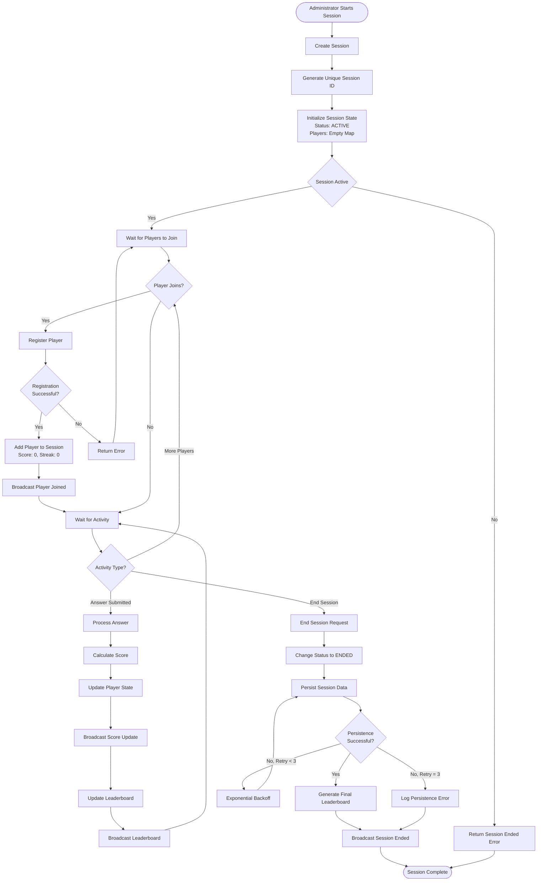
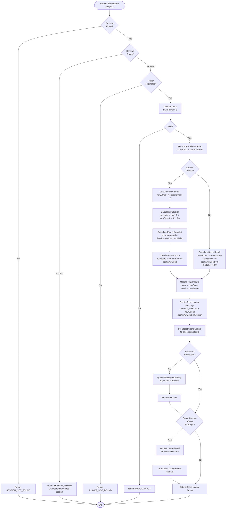
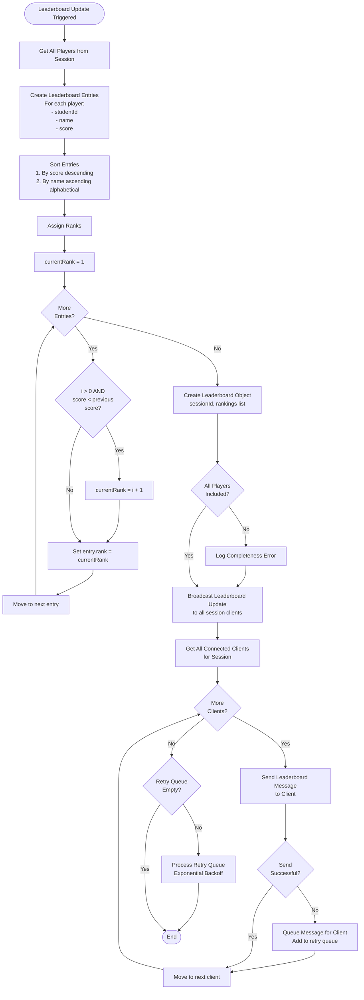
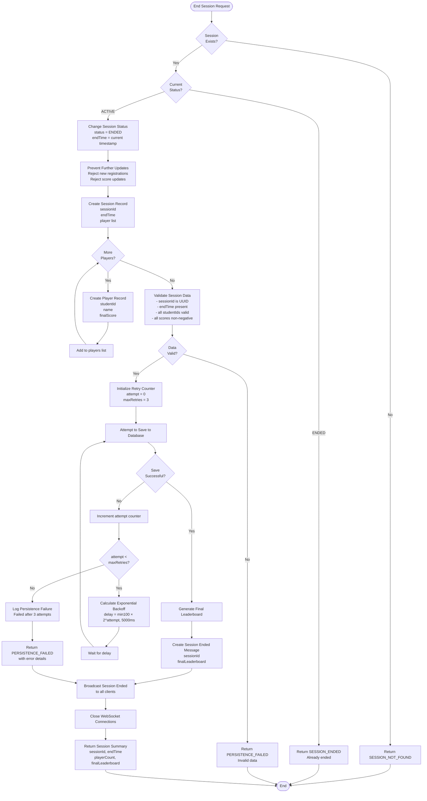
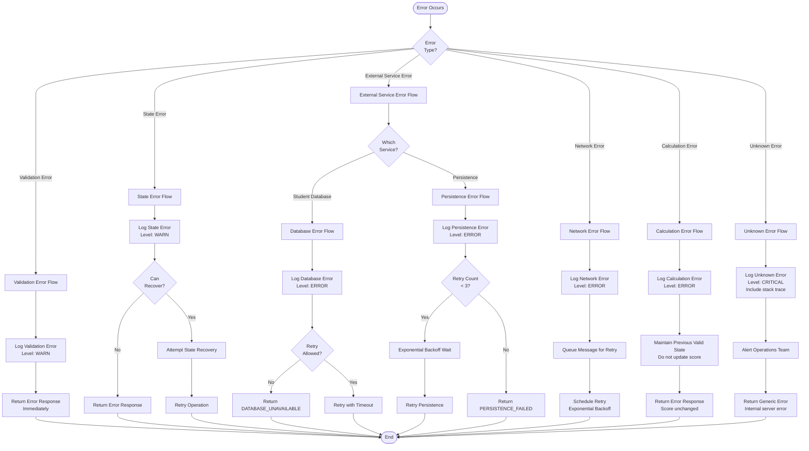

# Activity Diagrams
# Scoring System Workflows

**Version:** 1.0  
**Date:** February 9, 2026  

---

## Table of Contents

1. [Complete Session Lifecycle](#1-complete-session-lifecycle)
2. [Player Registration Flow](#2-player-registration-flow)
3. [Answer Submission and Score Update Flow](#3-answer-submission-and-score-update-flow)
4. [Leaderboard Update Flow](#4-leaderboard-update-flow)
5. [Session End and Persistence Flow](#5-session-end-and-persistence-flow)
6. [Error Handling Flow](#6-error-handling-flow)

---

## 1. Complete Session Lifecycle

This diagram shows the end-to-end flow from session creation to completion.



---

## 2. Player Registration Flow

Detailed flow for registering a player in an active session.

```mermaid
graph TD
    Start([Player Registration Request]) --> ValidateSession{Session<br/>Exists?}
    
    ValidateSession -->|No| Error1[Return SESSION_NOT_FOUND]
    Error1 --> End([End])
    
    ValidateSession -->|Yes| CheckStatus{Session<br/>Status?}
    
    CheckStatus -->|ENDED| Error2[Return SESSION_ENDED]
    Error2 --> End
    
    CheckStatus -->|ACTIVE| ValidateStudentID[Validate Student ID Format]
    ValidateStudentID --> FormatValid{Format<br/>Valid?}
    
    FormatValid -->|No| Error3[Return INVALID_INPUT<br/>Invalid student ID format]
    Error3 --> End
    
    FormatValid -->|Yes| CheckDuplicate{Student ID<br/>Already in<br/>Session?}
    
    CheckDuplicate -->|Yes| Error4[Return DUPLICATE_PLAYER]
    Error4 --> End
    
    CheckDuplicate -->|No| QueryDB[Query Student Database<br/>GET /students/{studentId}]
    QueryDB --> SetTimeout[Set 2-second Timeout]
    SetTimeout --> DBResponse{Database<br/>Response?}
    
    DBResponse -->|Timeout| Error5[Return DATABASE_UNAVAILABLE<br/>Student database timeout]
    Error5 --> End
    
    DBResponse -->|Network Error| Error6[Return DATABASE_UNAVAILABLE<br/>Network error]
    Error6 --> End
    
    DBResponse -->|404 Not Found| Error7[Return STUDENT_NOT_FOUND]
    Error7 --> End
    
    DBResponse -->|200 OK| ValidateResponse[Validate Response<br/>Has studentId and name?]
    ValidateResponse --> ResponseValid{Valid?}
    
    ResponseValid -->|No| Error8[Return DATABASE_UNAVAILABLE<br/>Invalid response format]
    Error8 --> End
    
    ResponseValid -->|Yes| CreatePlayerState[Create Player State<br/>studentId: from DB<br/>name: from DB<br/>score: 0<br/>streak: 0]
    
    CreatePlayerState --> AddToMap[Add to Session Players Map]
    AddToMap --> BroadcastJoin[Broadcast Player Joined<br/>to all clients]
    BroadcastJoin --> UpdateLB[Update Leaderboard]
    UpdateLB --> BroadcastLB[Broadcast Leaderboard Update]
    BroadcastLB --> Success[Return PlayerState]
    Success --> End
```

---

## 3. Answer Submission and Score Update Flow

Flow for processing an answer and updating the player's score.



---

## 4. Leaderboard Update Flow

Flow for updating and broadcasting the leaderboard.



---

## 5. Session End and Persistence Flow

Flow for ending a session and persisting results.



---

## 6. Error Handling Flow

General error handling and recovery flow.



---

## Legend

**Shapes:**
- `([Text])` - Start/End points
- `[Text]` - Process/Action
- `{Text?}` - Decision point
- `-->` - Flow direction
- `-->|Label|` - Conditional flow

**Color Coding (if rendered):**
- Green paths: Success flows
- Red paths: Error flows
- Yellow paths: Retry/Recovery flows

---

**End of Activity Diagrams Document**
