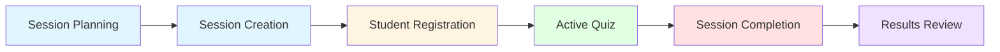
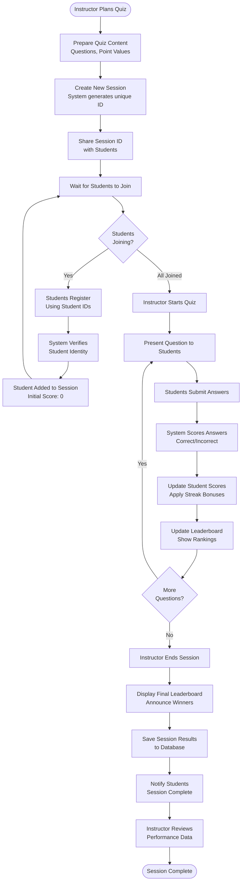
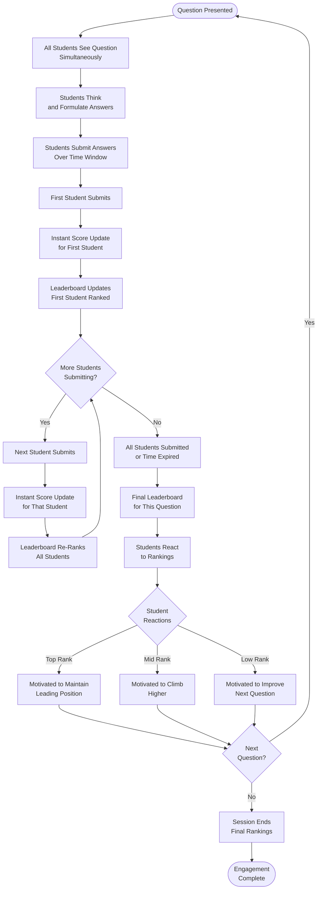
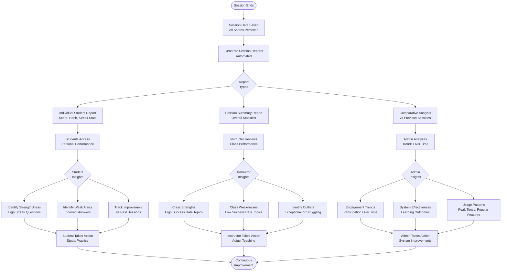
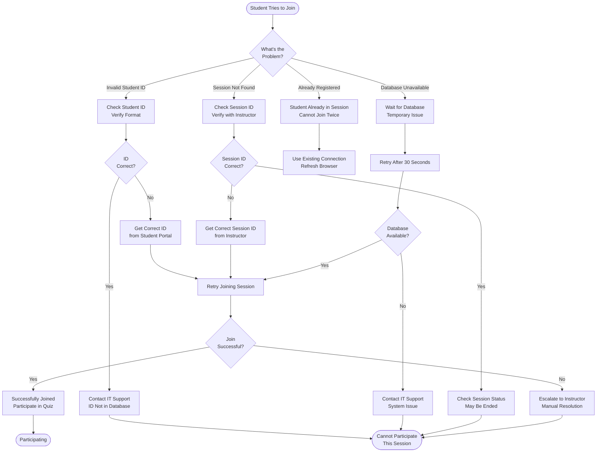
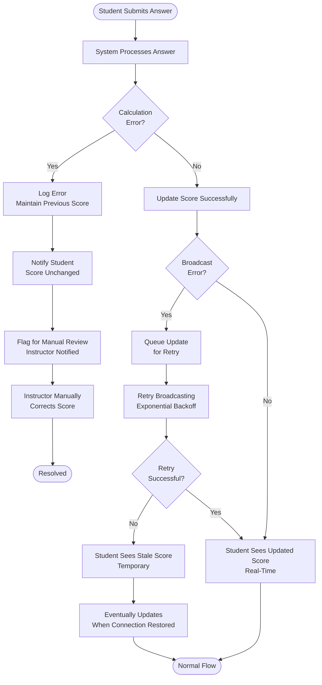
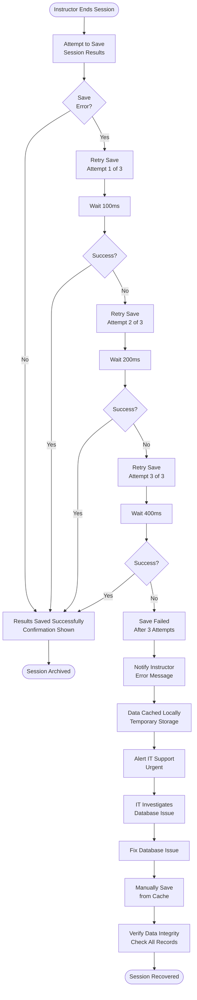

# Business Process Flows
# Scoring System - Analyst Perspective

**Version:** 1.0  
**Date:** February 9, 2026  
**Audience:** Business Analysts, Product Owners, Stakeholders  

---

## Table of Contents

1. [Overview](#1-overview)
2. [Stakeholder Roles](#2-stakeholder-roles)
3. [Quiz Session Lifecycle](#3-quiz-session-lifecycle)
4. [Student Participation Journey](#4-student-participation-journey)
5. [Instructor Session Management](#5-instructor-session-management)
6. [Real-Time Engagement Flow](#6-real-time-engagement-flow)
7. [Performance Tracking and Analytics](#7-performance-tracking-and-analytics)
8. [Exception Scenarios](#8-exception-scenarios)
9. [Business Rules Summary](#9-business-rules-summary)

---

## 1. Overview

### 1.1 Purpose

This document describes the scoring system's business processes from a non-technical perspective, focusing on:
- User interactions and experiences
- Business rules and policies
- Decision points and outcomes
- Stakeholder touchpoints
- Value delivery to end users

### 1.2 System Context

The scoring system supports interactive educational quiz sessions where:
- **Instructors** create and manage quiz sessions
- **Students** participate and answer questions in real-time
- **System** calculates scores, rewards consistency, and displays rankings
- **Administrators** review session results and student performance

### 1.3 Key Business Objectives

1. **Engagement:** Motivate students through real-time feedback and competitive elements
2. **Fairness:** Ensure accurate scoring and prevent gaming the system
3. **Recognition:** Reward consistent performance through streak multipliers
4. **Transparency:** Provide clear visibility into rankings and scores
5. **Accountability:** Track and persist results for academic records

---

## 2. Stakeholder Roles

### 2.1 Instructor/Session Administrator

**Responsibilities:**
- Create quiz sessions for classes or events
- Monitor student participation in real-time
- End sessions when quiz is complete
- Review final results and leaderboards

**Goals:**
- Engage students in active learning
- Assess understanding through quiz performance
- Identify high performers and students needing support

### 2.2 Student/Player

**Responsibilities:**
- Join quiz sessions using student credentials
- Answer questions as they are presented
- Monitor personal score and ranking

**Goals:**
- Demonstrate knowledge and understanding
- Achieve high scores and rankings
- Maintain answer streaks for bonus points

### 2.3 System Administrator

**Responsibilities:**
- Ensure system availability during sessions
- Monitor system performance and errors
- Maintain student database integration
- Archive session results

**Goals:**
- Maintain 99.5% uptime during active sessions
- Ensure data integrity and security
- Support multiple concurrent sessions

### 2.4 Academic Administrator

**Responsibilities:**
- Review session results and analytics
- Track student performance over time
- Generate reports for academic assessment

**Goals:**
- Understand student engagement patterns
- Identify learning gaps
- Support data-driven teaching decisions

---

## 3. Quiz Session Lifecycle

### 3.1 High-Level Session Flow



### 3.2 Detailed Session Lifecycle



### 3.3 Session States

| State | Description | Allowed Actions | Duration |
|-------|-------------|-----------------|----------|
| **Planning** | Instructor preparing quiz | None (pre-system) | Variable |
| **Created** | Session ID generated | Student registration | Until first question |
| **Active** | Quiz in progress | Answer submission, score updates | 15-60 minutes typical |
| **Ended** | Quiz completed | View results only | Permanent |
| **Archived** | Historical record | Read-only access | Indefinite |

---

## 4. Student Participation Journey

### 4.1 Student Experience Flow

```mermaid
graph TD
    Start([Student Receives<br/>Session Invitation]) --> HasID{Has Student<br/>ID Ready?}
    
    HasID -->|No| GetID[Retrieve Student ID<br/>from Student Portal]
    GetID --> JoinSession
    
    HasID -->|Yes| JoinSession[Join Session<br/>Enter Session ID]
    
    JoinSession --> EnterStudentID[Enter Student ID<br/>for Verification]
    
    EnterStudentID --> Verify{Identity<br/>Verified?}
    
    Verify -->|No - Invalid ID| ErrorMsg1[Error: Student ID<br/>Not Found]
    ErrorMsg1 --> ContactSupport[Contact Instructor<br/>or IT Support]
    ContactSupport --> End1([Cannot Participate])
    
    Verify -->|No - Already Joined| ErrorMsg2[Error: Already<br/>Registered]
    ErrorMsg2 --> WaitQuiz
    
    Verify -->|Yes| Welcome[Welcome Message<br/>Name Displayed]
    Welcome --> InitScore[Initial Score: 0<br/>Streak: 0]
    InitScore --> SeeBoard[View Leaderboard<br/>See Other Participants]
    
    SeeBoard --> WaitQuiz[Wait for Quiz to Start]
    WaitQuiz --> QuizStarts[Quiz Begins<br/>First Question Appears]
    
    QuizStarts --> ReadQ[Read Question]
    ReadQ --> ThinkAnswer[Consider Answer]
    ThinkAnswer --> SubmitAnswer[Submit Answer]
    
    SubmitAnswer --> Processing[System Processing...]
    Processing --> Result{Answer<br/>Correct?}
    
    Result -->|Yes - Correct| AddPoints[Points Added to Score<br/>Base Points × Multiplier]
    AddPoints --> IncStreak[Streak Increased<br/>Bonus Multiplier Applied]
    IncStreak --> ShowScore[Score Update Displayed<br/>+XX points 🎉]
    
    Result -->|No - Incorrect| NoPoints[No Points Added]
    NoPoints --> ResetStreak[Streak Reset to 0<br/>Multiplier Back to 1.0x]
    ResetStreak --> ShowScore
    
    ShowScore --> UpdateRank[Leaderboard Updates<br/>See New Ranking]
    UpdateRank --> MoreQ{More<br/>Questions?}
    
    MoreQ -->|Yes| ReadQ
    MoreQ -->|No| QuizEnds[Quiz Ends]
    
    QuizEnds --> FinalRank[View Final Ranking<br/>See Final Score]
    FinalRank --> Celebrate{Top<br/>Performer?}
    
    Celebrate -->|Yes| Winner[Congratulations!<br/>Recognition]
    Celebrate -->|No| Encourage[Good Effort!<br/>Try Again Next Time]
    
    Winner --> End2([Session Complete])
    Encourage --> End2
```



### 4.2 Student Scoring Experience

**Scenario: Student Answers 5 Questions**

| Question | Answer | Base Points | Streak Before | Multiplier | Points Earned | New Score | New Streak |
|----------|--------|-------------|---------------|------------|---------------|-----------|------------|
| 1 | ✓ Correct | 10 | 0 | 1.1x | 11 | 11 | 1 |
| 2 | ✓ Correct | 10 | 1 | 1.2x | 12 | 23 | 2 |
| 3 | ✗ Incorrect | 10 | 2 | 0x | 0 | 23 | 0 |
| 4 | ✓ Correct | 10 | 0 | 1.1x | 11 | 34 | 1 |
| 5 | ✓ Correct | 10 | 1 | 1.2x | 12 | 46 | 2 |

**Key Insights:**
- Consistent correct answers build streaks
- Streaks provide increasing bonuses (up to 3.0x)
- One incorrect answer resets the streak
- Students are motivated to maintain accuracy

---

## 5. Instructor Session Management

### 5.1 Instructor Workflow

```mermaid
graph TD
    Start([Instructor Prepares<br/>for Class]) --> Login[Login to System]
    
    Login --> CreateSession[Create New Quiz Session<br/>Click "New Session"]
    
    CreateSession --> GetID[System Generates<br/>Unique Session ID]
    GetID --> Display[Display Session ID<br/>on Screen]
    
    Display --> ShareMethod{How to<br/>Share?}
    
    ShareMethod -->|Projector| ProjectID[Project Session ID<br/>on Classroom Screen]
    ShareMethod -->|LMS| PostLMS[Post Session ID<br/>in Learning Management System]
    ShareMethod -->|Email| EmailID[Email Session ID<br/>to Students]
    
    ProjectID --> Monitor
    PostLMS --> Monitor
    EmailID --> Monitor
    
    Monitor[Monitor Student<br/>Registration]
    Monitor --> CheckCount[Check Participant Count<br/>vs Expected Attendance]
    
    CheckCount --> AllJoined{All Students<br/>Joined?}
    
    AllJoined -->|No| WaitMore[Wait for More Students<br/>Send Reminders]
    WaitMore --> CheckCount
    
    AllJoined -->|Yes| BeginQuiz[Begin Quiz<br/>Present First Question]
    
    BeginQuiz --> MonitorProgress[Monitor Real-Time Progress<br/>View Leaderboard]
    MonitorProgress --> ObserveEngagement[Observe Student Engagement<br/>Participation Rates]
    
    ObserveEngagement --> CheckIssues{Any Issues<br/>Observed?}
    
    CheckIssues -->|Yes - Technical| PauseTech[Pause for Technical Support<br/>Help Students Reconnect]
    PauseTech --> MonitorProgress
    
    CheckIssues -->|Yes - Confusion| PauseExplain[Pause to Clarify<br/>Explain Question]
    PauseExplain --> MonitorProgress
    
    CheckIssues -->|No| NextQ{More<br/>Questions?}
    
    NextQ -->|Yes| PresentNext[Present Next Question]
    PresentNext --> MonitorProgress
    
    NextQ -->|No| EndSession[End Quiz Session<br/>Click "End Session"]
    
    EndSession --> FinalResults[View Final Results<br/>Leaderboard & Statistics]
    
    FinalResults --> Announce[Announce Top Performers<br/>Recognize Achievement]
    Announce --> SaveConfirm[Confirm Results Saved<br/>Check Save Status]
    
    SaveConfirm --> Saved{Results<br/>Saved?}
    
    Saved -->|No| Retry[Retry Save<br/>Contact IT if Fails]
    Retry --> SaveConfirm
    
    Saved -->|Yes| DownloadReport[Download Session Report<br/>Optional]
    
    DownloadReport --> Review[Review Performance Patterns<br/>Identify Learning Gaps]
    Review --> Plan[Plan Follow-Up Actions<br/>Additional Support]
    
    Plan --> End([Session Management<br/>Complete])
```

### 5.2 Instructor Decision Points

**During Session:**
1. **When to start?** Wait for sufficient participation (e.g., 80% of expected students)
2. **Pacing:** Allow adequate time per question based on difficulty
3. **Intervention:** Pause if technical issues affect multiple students
4. **When to end?** After all planned questions or at scheduled time

**After Session:**
1. **Recognition:** Acknowledge top performers publicly or privately
2. **Support:** Identify students with low scores for additional help
3. **Content Review:** Analyze questions with high error rates
4. **Follow-Up:** Plan remedial sessions or additional practice

---

## 6. Real-Time Engagement Flow

### 6.1 Live Session Dynamics



### 6.2 Engagement Metrics

**Real-Time Indicators:**
- **Participation Rate:** % of registered students actively answering
- **Response Time:** Average time to submit answers
- **Streak Distribution:** How many students maintaining streaks
- **Score Spread:** Gap between top and bottom performers
- **Leaderboard Volatility:** How frequently rankings change

**Engagement Patterns:**
- **High Engagement:** Quick responses, high participation, active streaks
- **Moderate Engagement:** Slower responses, some non-participation
- **Low Engagement:** Many timeouts, low participation, few streaks

---

## 7. Performance Tracking and Analytics

### 7.1 Post-Session Analysis Flow



### 7.2 Key Performance Indicators (KPIs)

**Student-Level KPIs:**
- Average score per session
- Highest streak achieved
- Participation consistency
- Improvement rate over time
- Ranking percentile

**Session-Level KPIs:**
- Total participants
- Average score
- Score distribution (standard deviation)
- Question difficulty (% correct)
- Engagement rate (% active participants)

**System-Level KPIs:**
- Sessions per day/week/month
- Total active students
- Average session duration
- System uptime during sessions
- Data persistence success rate

---

## 8. Exception Scenarios

### 8.1 Student Cannot Join Session



### 8.2 Score Update Fails



### 8.3 Session Cannot Be Saved



---

## 9. Business Rules Summary

### 9.1 Scoring Rules

| Rule | Description | Rationale |
|------|-------------|-----------|
| **BR-001** | Initial score is always 0 | Fair starting point for all students |
| **BR-002** | Correct answer adds base points × multiplier | Rewards correct knowledge |
| **BR-003** | Incorrect answer adds 0 points | No penalty, but no reward |
| **BR-004** | Streak increases by 1 for each correct answer | Tracks consistency |
| **BR-005** | Streak resets to 0 on incorrect answer | Encourages sustained accuracy |
| **BR-006** | Multiplier = 1.0 + (streak × 0.1) | Linear bonus for streaks |
| **BR-007** | Maximum multiplier is 3.0 | Caps bonus at 20+ streak |
| **BR-008** | Scores cannot be negative | Prevents unfair penalties |
| **BR-009** | Points are rounded down (floor) | Consistent integer scoring |

### 9.2 Session Rules

| Rule | Description | Rationale |
|------|-------------|-----------|
| **BR-101** | Each session has unique ID | Prevents confusion between sessions |
| **BR-102** | Students can only join active sessions | Prevents late joining after quiz ends |
| **BR-103** | Students cannot join same session twice | Prevents duplicate participation |
| **BR-104** | Ended sessions cannot accept new answers | Maintains result integrity |
| **BR-105** | Session results must be saved before archiving | Ensures data persistence |
| **BR-106** | Instructors can end sessions at any time | Provides control flexibility |

### 9.3 Student Rules

| Rule | Description | Rationale |
|------|-------------|-----------|
| **BR-201** | Student ID must exist in database | Verifies legitimate participants |
| **BR-202** | Student name comes from database | Ensures accurate identification |
| **BR-203** | Students see real-time score updates | Provides immediate feedback |
| **BR-204** | Students see current leaderboard ranking | Enables competitive engagement |
| **BR-205** | Students can view final results after session | Supports learning review |

### 9.4 Leaderboard Rules

| Rule | Description | Rationale |
|------|-------------|-----------|
| **BR-301** | Ranked by score (highest first) | Clear performance hierarchy |
| **BR-302** | Ties broken by name (alphabetical) | Consistent, fair tie-breaking |
| **BR-303** | Same score = same rank | Fair recognition of equal performance |
| **BR-304** | All registered students appear | Complete transparency |
| **BR-305** | Updates in real-time during session | Maintains engagement |

### 9.5 Data Integrity Rules

| Rule | Description | Rationale |
|------|-------------|-----------|
| **BR-401** | All session data must be validated before save | Prevents corrupt data |
| **BR-402** | Failed saves retry up to 3 times | Handles transient failures |
| **BR-403** | Critical errors alert IT support | Ensures rapid response |
| **BR-404** | Student IDs are verified against database | Prevents unauthorized access |
| **BR-405** | Session results are immutable once saved | Maintains academic integrity |

---

## 10. Success Metrics

### 10.1 Student Success Indicators

- **Engagement:** 90%+ of registered students actively participate
- **Completion:** 95%+ of students complete all questions
- **Satisfaction:** Positive feedback on real-time experience
- **Learning:** Improvement in scores across multiple sessions

### 10.2 Instructor Success Indicators

- **Adoption:** Regular use of system for quizzes
- **Efficiency:** Reduced time for manual scoring
- **Insights:** Actionable data on student performance
- **Satisfaction:** Positive feedback on ease of use

### 10.3 System Success Indicators

- **Reliability:** 99.5%+ uptime during sessions
- **Performance:** <100ms score update latency
- **Scalability:** Support for 50+ concurrent sessions
- **Data Integrity:** 99.9%+ successful data persistence

---

**End of Business Process Flows Document**
