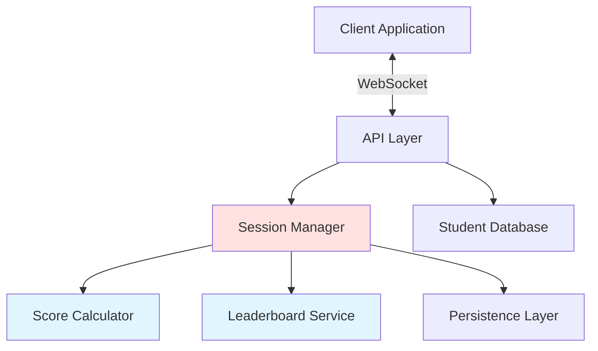

# Design Document: Scoring System

## Overview

The scoring system is designed as a real-time, event-driven application that tracks player performance during quiz or game sessions. The architecture follows a layered approach with clear separation between the data layer, business logic, and presentation layer.

### Key Design Principles

1. **Real-time responsiveness**: Score updates propagate to all clients within 100ms
2. **Data integrity**: All score calculations are atomic and validated
3. **Scalability**: Support for multiple concurrent sessions with many players
4. **Fault tolerance**: Graceful degradation when external services are unavailable
5. **Testability**: Pure functions for score calculation enable comprehensive testing

### Technology Considerations

The design is language-agnostic but assumes:
- A real-time communication mechanism (WebSockets, Server-Sent Events, or similar)
- A persistent data store (database or file system)
- HTTP client for student database integration
- Event-driven or reactive programming model for real-time updates

## Architecture

### System Components



### Component Responsibilities

**API Layer**
- Handles client connections and authentication
- Routes requests to appropriate services
- Manages WebSocket connections for real-time updates
- Interfaces with Student Database for player registration

**Session Manager**
- Creates and manages session lifecycle
- Maintains session state (active players, scores, streaks)
- Coordinates between Score Calculator and Leaderboard Service
- Triggers persistence operations on session end

**Score Calculator**
- Pure function for calculating points with multipliers
- Manages streak tracking per player
- Validates score updates
- Ensures score integrity (non-negative, integer values)

**Leaderboard Service**
- Maintains sorted ranking of players
- Handles tie-breaking (same score → alphabetical order)
- Generates leaderboard snapshots for display
- Optimized for frequent updates

**Persistence Layer**
- Abstracts data storage operations
- Implements retry logic for failed writes
- Validates data before storage
- Supports querying historical session data

**Student Database Client**
- Handles HTTP requests to external student database
- Implements timeout and retry logic
- Validates responses
- Caches student information (optional optimization)

## Components and Interfaces

### Session Manager

**State:**
```
Session {
  id: SessionId (unique identifier)
  status: SessionStatus (active | ended)
  players: Map<StudentId, PlayerState>
  startTime: Timestamp
  endTime: Timestamp | null
}

PlayerState {
  studentId: StudentId
  name: String
  score: Integer (non-negative)
  streak: Integer (non-negative)
}

SessionStatus = "active" | "ended"
```

**Interface:**
```
createSession() -> SessionId
  Creates a new session with unique ID and active status
  Returns the session identifier

registerPlayer(sessionId: SessionId, studentId: StudentId) -> Result<PlayerState, Error>
  Validates session is active
  Queries Student Database for student name
  Initializes player with score=0, streak=0
  Prevents duplicate registration
  Returns player state or error

submitAnswer(sessionId: SessionId, studentId: StudentId, isCorrect: Boolean, basePoints: Integer) -> Result<ScoreUpdate, Error>
  Validates session is active and player is registered
  Delegates to Score Calculator for point calculation
  Updates player state
  Triggers leaderboard update
  Broadcasts score update to all clients
  Returns updated score and streak

endSession(sessionId: SessionId) -> Result<SessionSummary, Error>
  Changes session status to ended
  Triggers persistence of all player scores
  Returns final session summary

getSessionState(sessionId: SessionId) -> Result<Session, Error>
  Returns current session state including all players
```

### Score Calculator

**Interface:**
```
calculateScore(currentScore: Integer, currentStreak: Integer, isCorrect: Boolean, basePoints: Integer) -> ScoreResult

ScoreResult {
  newScore: Integer
  newStreak: Integer
  pointsAwarded: Integer
  multiplierApplied: Float
}
```

**Algorithm:**
```
function calculateScore(currentScore, currentStreak, isCorrect, basePoints):
  if not isCorrect:
    return {
      newScore: currentScore,
      newStreak: 0,
      pointsAwarded: 0,
      multiplierApplied: 0.0
    }
  
  newStreak = currentStreak + 1
  multiplier = min(1.0 + (newStreak * 0.1), 3.0)
  pointsAwarded = floor(basePoints * multiplier)
  newScore = currentScore + pointsAwarded
  
  return {
    newScore: newScore,
    newStreak: newStreak,
    pointsAwarded: pointsAwarded,
    multiplierApplied: multiplier
  }
```

**Invariants:**
- Scores are always non-negative integers
- Streaks are always non-negative integers
- Multiplier is always between 1.0 and 3.0 (inclusive)
- Incorrect answers always reset streak to 0
- Incorrect answers never change the score

### Leaderboard Service

**State:**
```
Leaderboard {
  sessionId: SessionId
  rankings: List<LeaderboardEntry>
}

LeaderboardEntry {
  rank: Integer
  studentId: StudentId
  name: String
  score: Integer
}
```

**Interface:**
```
updateLeaderboard(sessionId: SessionId, players: Map<StudentId, PlayerState>) -> Leaderboard
  Sorts players by score (descending), then by name (ascending)
  Assigns ranks (ties get same rank)
  Returns updated leaderboard

getLeaderboard(sessionId: SessionId) -> Leaderboard
  Returns current leaderboard state
```

**Ranking Algorithm:**
```
function updateLeaderboard(sessionId, players):
  entries = []
  
  for each (studentId, playerState) in players:
    entries.append({
      studentId: studentId,
      name: playerState.name,
      score: playerState.score
    })
  
  // Sort by score descending, then name ascending
  entries.sort((a, b) => {
    if a.score != b.score:
      return b.score - a.score  // Higher score first
    return a.name.compareTo(b.name)  // Alphabetical for ties
  })
  
  // Assign ranks
  currentRank = 1
  for i in 0 to entries.length - 1:
    if i > 0 and entries[i].score < entries[i-1].score:
      currentRank = i + 1
    entries[i].rank = currentRank
  
  return Leaderboard {
    sessionId: sessionId,
    rankings: entries
  }
```

### Persistence Layer

**Interface:**
```
saveSessionResults(session: Session) -> Result<void, Error>
  Validates session data
  Stores session with all player scores
  Implements retry logic (up to 3 attempts)
  Returns success or error

SessionRecord {
  sessionId: SessionId
  endTime: Timestamp
  players: List<PlayerRecord>
}

PlayerRecord {
  studentId: StudentId
  name: String
  finalScore: Integer
}
```

**Retry Logic:**
```
function saveSessionResults(session):
  maxRetries = 3
  attempt = 0
  
  while attempt < maxRetries:
    try:
      validate(session)
      store(session)
      return Success
    catch error:
      attempt += 1
      if attempt >= maxRetries:
        return Error("Failed to save after 3 attempts: " + error)
      wait(exponentialBackoff(attempt))
  
  return Error("Unexpected retry failure")

function exponentialBackoff(attempt):
  return min(100 * (2 ^ attempt), 5000)  // Max 5 second wait
```

### Student Database Client

**Interface:**
```
getStudentInfo(studentId: StudentId) -> Result<StudentInfo, Error>
  Queries external student database
  Implements 2-second timeout
  Validates response contains required fields
  Returns student information or error

StudentInfo {
  studentId: StudentId
  name: String
}
```

**Error Handling:**
```
function getStudentInfo(studentId):
  if not isValidStudentIdFormat(studentId):
    return Error("Invalid student ID format")
  
  try:
    response = httpGet(studentDbUrl + "/students/" + studentId, timeout=2000ms)
    
    if response.status != 200:
      return Error("Student not found")
    
    data = parseJson(response.body)
    
    if not data.studentId or not data.name:
      return Error("Invalid response from student database")
    
    return Success(StudentInfo {
      studentId: data.studentId,
      name: data.name
    })
    
  catch TimeoutError:
    return Error("Student database timeout")
  catch NetworkError as e:
    return Error("Student database unavailable: " + e)
```

## Data Models

### Core Data Types

```
SessionId = String (UUID format)
StudentId = String (alphanumeric, 6-12 characters)
Timestamp = Integer (Unix timestamp in milliseconds)

Error {
  code: ErrorCode
  message: String
}

ErrorCode = 
  | "SESSION_NOT_FOUND"
  | "SESSION_ENDED"
  | "PLAYER_NOT_FOUND"
  | "DUPLICATE_PLAYER"
  | "STUDENT_NOT_FOUND"
  | "DATABASE_UNAVAILABLE"
  | "INVALID_INPUT"
  | "PERSISTENCE_FAILED"
```

### Real-Time Update Messages

```
ScoreUpdateMessage {
  type: "SCORE_UPDATE"
  sessionId: SessionId
  studentId: StudentId
  newScore: Integer
  newStreak: Integer
  pointsAwarded: Integer
  multiplierApplied: Float
}

LeaderboardUpdateMessage {
  type: "LEADERBOARD_UPDATE"
  sessionId: SessionId
  leaderboard: Leaderboard
}

SessionEndedMessage {
  type: "SESSION_ENDED"
  sessionId: SessionId
  finalLeaderboard: Leaderboard
}
```

### Validation Rules

**StudentId Validation:**
- Must be alphanumeric
- Length between 6 and 12 characters
- No special characters except hyphens

**Score Validation:**
- Must be non-negative integer
- Maximum value: 2^31 - 1 (to prevent overflow)

**Session Validation:**
- SessionId must be valid UUID
- Status must be "active" or "ended"
- Players map must not be null
- All player states must be valid

## Correctness Properties

*A property is a characteristic or behavior that should hold true across all valid executions of a system—essentially, a formal statement about what the system should do. Properties serve as the bridge between human-readable specifications and machine-verifiable correctness guarantees.*


### Property 1: Player Registration Initializes Score to Zero

*For any* valid student ID and active session, when a player successfully registers, their initial score should be zero and their streak should be zero.

**Validates: Requirements 1.3**

### Property 2: Duplicate Registration Prevention

*For any* session and student ID, attempting to register the same student ID twice in the same session should result in an error, and the player list should remain unchanged.

**Validates: Requirements 1.4**

### Property 3: Score Calculation with Multipliers

*For any* current score, current streak, base points, and answer correctness, the score calculation should:
- If correct: add (base points × multiplier) to the score, where multiplier = min(1.0 + ((streak + 1) × 0.1), 3.0)
- If incorrect: maintain the current score unchanged

**Validates: Requirements 2.1, 2.2, 2.4**

### Property 4: Incorrect Answer Resets Streak

*For any* player state with any streak value, submitting an incorrect answer should reset the streak to zero while maintaining the current score.

**Validates: Requirements 2.3**

### Property 5: Score Non-Negativity Invariant

*For any* sequence of score operations (registrations, correct answers, incorrect answers), all player scores should remain non-negative integers at all times.

**Validates: Requirements 2.5**

### Property 6: Score Update Broadcast

*For any* score change in a session, all connected clients in that session should receive a score update message containing the student ID, new score, new streak, points awarded, and multiplier applied.

**Validates: Requirements 3.2**

### Property 7: Leaderboard Update Propagation

*For any* score change that affects leaderboard rankings, all players in the session should receive an updated leaderboard message.

**Validates: Requirements 3.3**

### Property 8: Session ID Uniqueness

*For any* set of created sessions, all session IDs should be unique (no duplicates).

**Validates: Requirements 4.1**

### Property 9: Active Session Operations

*For any* active session, player registration requests and score update requests should be accepted and processed successfully (assuming valid inputs).

**Validates: Requirements 4.2**

### Property 10: Session End Persistence

*For any* session with registered players, when the session ends, all player data (student ID, name, final score) should be persisted along with the session ID and end timestamp.

**Validates: Requirements 4.3, 6.1, 6.2**

### Property 11: Ended Session Immutability

*For any* session that has ended, all subsequent score update attempts should be rejected with an error, and the session state should remain unchanged.

**Validates: Requirements 4.4**

### Property 12: Session State Consistency

*For any* session at any point in time, querying the session state should return accurate information about all registered players, including their current scores and streaks.

**Validates: Requirements 4.5**

### Property 13: Leaderboard Sorting and Ranking

*For any* set of players in a session, the leaderboard should:
- Rank players by score in descending order (highest score = rank 1)
- For players with equal scores, assign the same rank and order them alphabetically by name
- Include all required fields (rank, student ID, name, score) for each entry

**Validates: Requirements 5.1, 5.2, 5.3**

### Property 14: Leaderboard Completeness

*For any* session, the leaderboard should include entries for all registered players in that session (no players should be missing).

**Validates: Requirements 5.4**

### Property 15: Persistence Retry Behavior

*For any* storage operation that fails, the system should retry up to 3 times with exponential backoff before returning an error.

**Validates: Requirements 6.3**

### Property 16: Persistence Data Validation

*For any* session data being persisted, all required fields (session ID, student ID, name, score, timestamp) should be validated before storage, and invalid data should be rejected.

**Validates: Requirements 6.4**

### Property 17: Student Database Lookup

*For any* student ID query to the database, the system should use the student ID as the lookup key and validate that the response contains both student ID and name fields.

**Validates: Requirements 7.1, 7.3**

### Property 18: Database Unavailability Handling

*For any* player registration attempt when the student database is unavailable, the system should return an error and prevent the registration from completing.

**Validates: Requirements 7.2**

### Property 19: Score Calculation Error Recovery

*For any* error that occurs during score calculation, the system should maintain the player's previous valid score unchanged and log the error.

**Validates: Requirements 8.1**

### Property 20: Network Error Message Queuing

*For any* network error during real-time update transmission, the system should queue the update message and retry transmission rather than dropping the message.

**Validates: Requirements 8.2**

### Property 21: Invalid Student ID Rejection

*For any* student ID that doesn't match the valid format (alphanumeric, 6-12 characters), the system should reject it with a descriptive error message.

**Validates: Requirements 8.3**

### Property 22: Student Database Integration Round Trip

*For any* valid student ID, if the student database returns student information, registering that student should result in the player's name matching the name from the database.

**Validates: Requirements 1.1**

### Property 23: Invalid Student ID Error Handling

*For any* student ID that is not found in the student database, the registration attempt should be rejected with an appropriate error message.

**Validates: Requirements 1.2**

## Error Handling

### Error Categories

**Validation Errors**
- Invalid student ID format
- Invalid session ID format
- Invalid score values (negative or non-integer)
- Missing required fields

**State Errors**
- Session not found
- Session already ended
- Player not registered
- Duplicate player registration

**External Service Errors**
- Student database unavailable
- Student database timeout
- Student not found in database
- Invalid database response

**Persistence Errors**
- Storage operation failed
- Data validation failed before storage
- Retry limit exceeded

### Error Handling Strategies

**Fail Fast**
- Input validation errors should be caught immediately
- Return descriptive error messages to the caller
- Do not proceed with invalid data

**Graceful Degradation**
- If leaderboard update fails, continue with score calculation
- If broadcast fails, queue message for retry
- Prioritize core functionality (score calculation) over secondary features (leaderboard display)

**Retry with Backoff**
- Storage operations: retry up to 3 times with exponential backoff
- Network updates: queue and retry with exponential backoff
- Student database queries: fail fast (no retry) to maintain responsiveness

**State Protection**
- On calculation errors, maintain previous valid state
- Use atomic operations for state updates
- Validate state before and after mutations

### Error Response Format

```
ErrorResponse {
  code: ErrorCode
  message: String
  details: Map<String, String> (optional)
  timestamp: Timestamp
}
```

## Testing Strategy

### Dual Testing Approach

The testing strategy employs both unit tests and property-based tests to ensure comprehensive coverage:

**Unit Tests** focus on:
- Specific examples that demonstrate correct behavior
- Edge cases (empty sessions, zero scores, maximum multipliers)
- Error conditions (invalid inputs, database failures)
- Integration points between components

**Property-Based Tests** focus on:
- Universal properties that hold for all inputs
- Comprehensive input coverage through randomization
- Invariants that must be maintained
- Round-trip properties (e.g., database integration)

Together, these approaches provide comprehensive coverage where unit tests catch concrete bugs and property-based tests verify general correctness.

### Property-Based Testing Configuration

**Testing Library Selection:**
- Python: Hypothesis
- TypeScript/JavaScript: fast-check
- Java: jqwik
- Go: gopter
- Rust: proptest

**Test Configuration:**
- Minimum 100 iterations per property test (due to randomization)
- Each property test must reference its design document property
- Tag format: `Feature: scoring-system, Property {number}: {property_text}`
- Each correctness property must be implemented by a single property-based test

### Test Coverage Requirements

**Score Calculator (Pure Functions)**
- Property tests for all calculation properties (Properties 3, 4, 5)
- Unit tests for edge cases (zero base points, maximum streak, overflow prevention)
- Example-based tests for specific multiplier values

**Session Manager (Stateful)**
- Property tests for state consistency (Properties 9, 11, 12)
- Property tests for registration (Properties 1, 2)
- Unit tests for session lifecycle transitions
- Integration tests with mocked dependencies

**Leaderboard Service**
- Property tests for sorting and ranking (Properties 13, 14)
- Unit tests for tie-breaking scenarios
- Unit tests for empty leaderboards

**Persistence Layer**
- Property tests for data completeness (Property 10, 16)
- Property tests for retry behavior (Property 15)
- Unit tests with mocked storage backend
- Integration tests with real storage

**Student Database Client**
- Property tests for database integration (Properties 17, 18, 22, 23)
- Unit tests for timeout handling
- Unit tests for response validation
- Integration tests with mocked HTTP responses

**Real-Time Updates**
- Property tests for broadcast behavior (Properties 6, 7)
- Property tests for message queuing (Property 20)
- Unit tests for WebSocket connection handling
- Integration tests for end-to-end message flow

### Example Property Test Structure

```
Test: Property 3 - Score Calculation with Multipliers
Tag: Feature: scoring-system, Property 3: Score calculation with multipliers
Iterations: 100

For each iteration:
  Generate random:
    - currentScore (0 to 10000)
    - currentStreak (0 to 50)
    - basePoints (1 to 100)
    - isCorrect (true or false)
  
  Calculate expected result:
    - If correct: expectedMultiplier = min(1.0 + ((currentStreak + 1) * 0.1), 3.0)
    - If correct: expectedPoints = floor(basePoints * expectedMultiplier)
    - If correct: expectedScore = currentScore + expectedPoints
    - If incorrect: expectedScore = currentScore, expectedStreak = 0
  
  Execute: result = calculateScore(currentScore, currentStreak, isCorrect, basePoints)
  
  Assert:
    - result.newScore == expectedScore
    - result.newStreak == (isCorrect ? currentStreak + 1 : 0)
    - result.multiplierApplied == expectedMultiplier
    - result.pointsAwarded == expectedPoints
```

### Integration Testing

**End-to-End Scenarios:**
1. Complete session flow: create → register players → submit answers → end session → verify persistence
2. Multi-player concurrent updates: verify leaderboard consistency
3. Error recovery: simulate failures and verify graceful degradation
4. Database integration: verify correct student information retrieval

**Performance Testing:**
- Verify score updates complete within 100ms (requirement 3.1)
- Verify system handles multiple concurrent sessions
- Verify leaderboard updates scale with player count

### Mocking Strategy

**Student Database:**
- Mock HTTP client for unit tests
- Provide configurable responses (success, not found, timeout, error)
- Verify correct request format

**Persistence Layer:**
- Mock storage backend for unit tests
- Simulate failures for retry testing
- Verify data format and completeness

**WebSocket Connections:**
- Mock client connections for broadcast testing
- Verify message format and delivery
- Simulate network errors for queue testing
