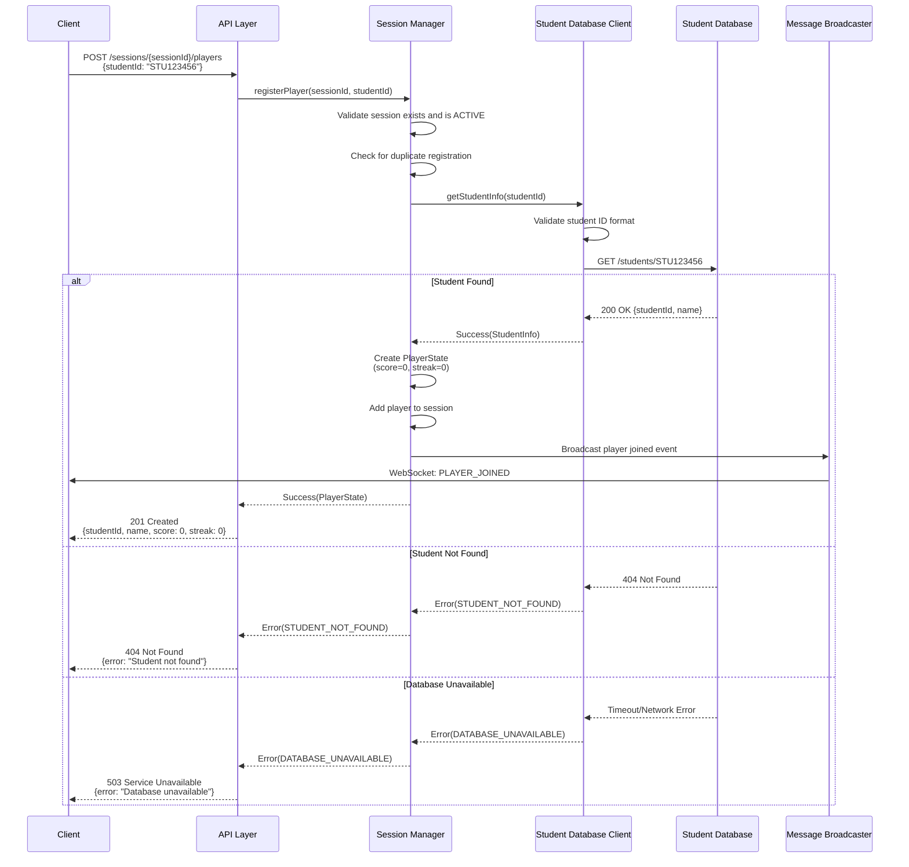
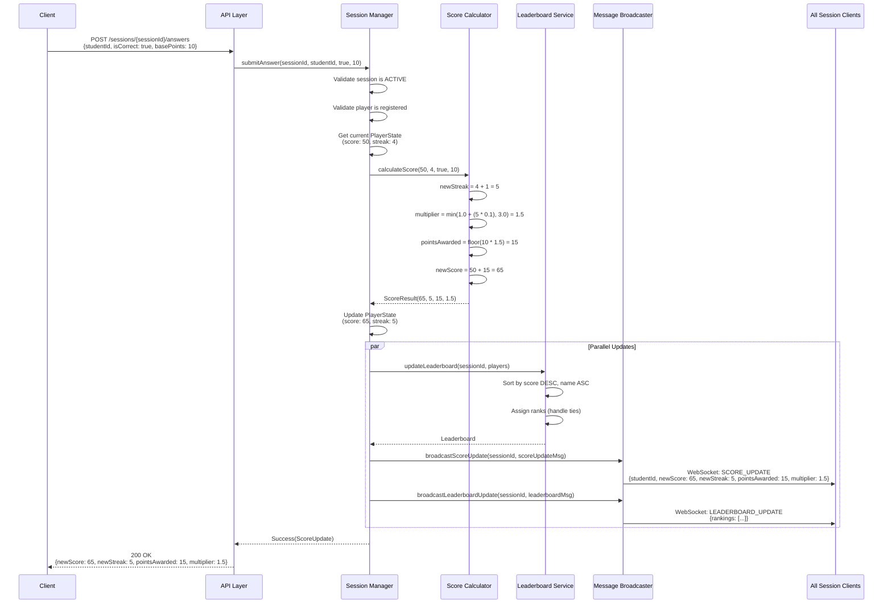
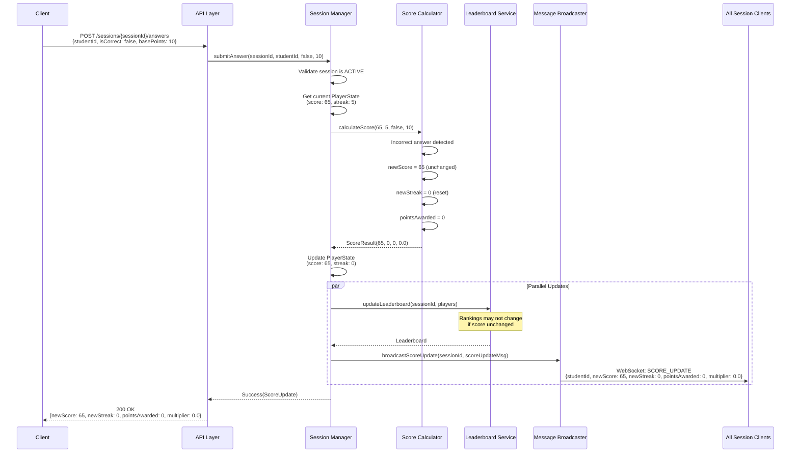
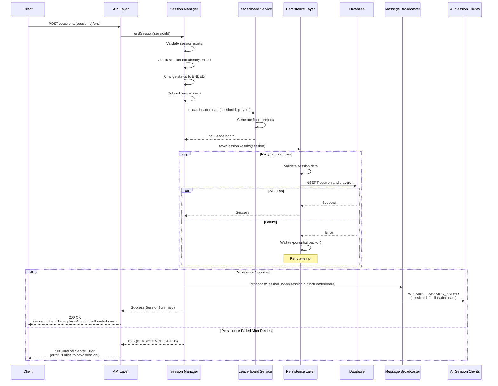
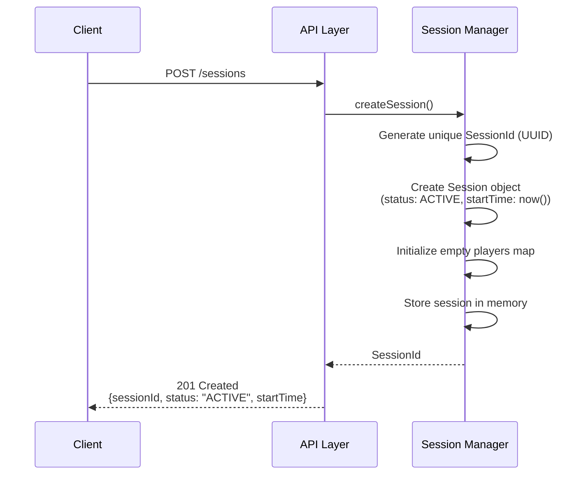
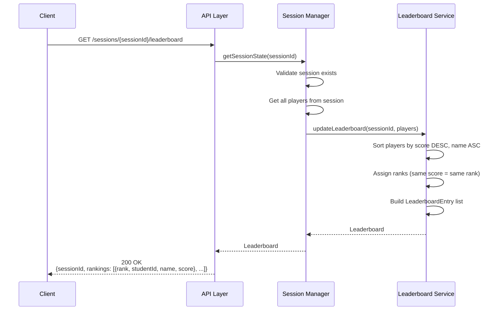
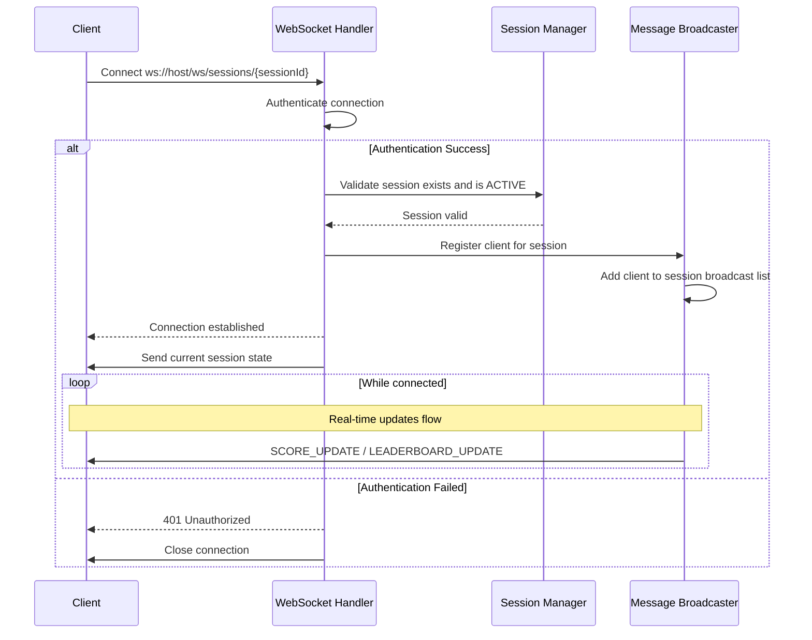
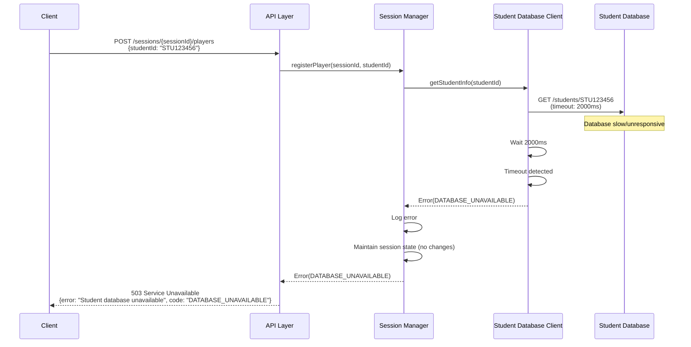
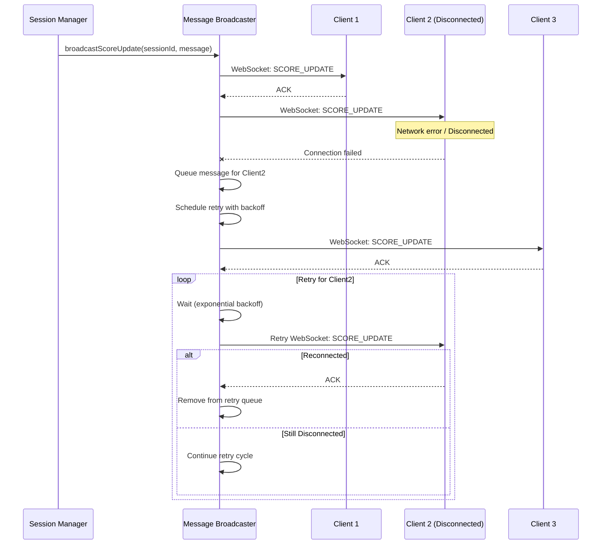
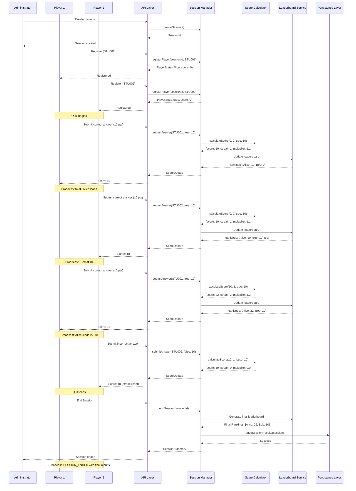

# Sequence Diagrams

## Overview

This document contains sequence diagrams illustrating the key interactions and flows within the scoring system. These diagrams show how components collaborate to fulfill the system's requirements.

---

## 1. Player Registration Flow

---

## 2. Score Update Flow (Correct Answer)

---

## 3. Score Update Flow (Incorrect Answer)

---

## 4. Session End Flow

---

## 5. Session Creation Flow

---

## 6. Get Leaderboard Flow

---

## 7. WebSocket Connection Flow

---

## 8. Error Handling Flow - Database Timeout

---

## 9. Error Handling Flow - Network Failure During Broadcast

---

## 10. Complete Quiz Session Flow (End-to-End)

---

## Notes

### Timing Constraints

- **Score updates**: Must complete within 100ms from submission to broadcast
- **Database queries**: 2-second timeout for student database lookups
- **Persistence retries**: Exponential backoff (100ms, 200ms, 400ms) with max 5s wait

### Concurrency Considerations

- Multiple players can submit answers simultaneously
- Session Manager must handle concurrent score updates atomically
- Leaderboard updates are triggered after each score change
- Message broadcasting happens asynchronously to avoid blocking

### Error Recovery

- Student database failures prevent registration but don't crash the system
- Network failures during broadcast trigger message queuing and retry
- Persistence failures are retried up to 3 times before reporting error
- Score calculation errors maintain previous valid state

### Real-Time Communication

- WebSocket connections are maintained per client per session
- All clients in a session receive score and leaderboard updates
- Disconnected clients are removed from broadcast list
- Reconnecting clients receive current session state
