# Use Case Diagrams
# Scoring System - Systems Analyst Perspective

**Version:** 1.0  
**Date:** February 9, 2026  
**Audience:** Systems Analysts, Business Analysts, Requirements Engineers  

---

## Table of Contents

1. [Overview](#1-overview)
2. [System Context Diagram](#2-system-context-diagram)
3. [High-Level Use Case Diagram](#3-high-level-use-case-diagram)
4. [Detailed Use Case Diagrams by Actor](#4-detailed-use-case-diagrams-by-actor)
5. [Use Case Specifications](#5-use-case-specifications)
6. [Use Case Relationships](#6-use-case-relationships)
7. [Traceability Matrix](#7-traceability-matrix)

---

## 1. Overview

### 1.1 Purpose

This document provides use case diagrams and specifications for the Scoring System, illustrating:
- System actors (users and external systems)
- Use cases (functional requirements)
- Relationships between use cases (include, extend, generalization)
- System boundaries
- Actor-use case interactions

### 1.2 Notation Guide

**Actors:**
- 👤 Human actors (users)
- 🖥️ System actors (external systems)
- Stick figures in diagrams

**Use Cases:**
- Ovals containing use case names
- Represent system functionality

**Relationships:**
- Solid line: Association (actor interacts with use case)
- Dashed arrow with «include»: Mandatory inclusion
- Dashed arrow with «extend»: Optional extension
- Solid arrow: Generalization (inheritance)

**System Boundary:**
- Rectangle containing use cases
- Represents the system scope

---

## 2. System Context Diagram

### 2.1 System Actors

```mermaid
graph TB
    subgraph External
        Student[👤 Student/Player]
        Instructor[👤 Instructor]
        Admin[👤 System Administrator]
        AcademicAdmin[👤 Academic Administrator]
        StudentDB[🖥️ Student Database]
        DataStore[🖥️ Data Store]
    end
    
    subgraph "Scoring System"
        System[Scoring System<br/>Core Application]
    end
    
    Student -->|Participates| System
    Instructor -->|Manages| System
    Admin -->|Monitors| System
    AcademicAdmin -->|Reviews| System
    System -->|Queries| StudentDB
    System -->|Persists| DataStore
    
    style System fill:#e1f5ff
    style StudentDB fill:#ffe1e1
    style DataStore fill:#ffe1e1
```

### 2.2 Actor Descriptions

| Actor | Type | Description | Goals |
|-------|------|-------------|-------|
| **Student** | Primary | Participant in quiz sessions | Answer questions, earn points, see rankings |
| **Instructor** | Primary | Session creator and manager | Create sessions, monitor progress, review results |
| **System Administrator** | Secondary | Technical system manager | Ensure uptime, monitor performance, troubleshoot |
| **Academic Administrator** | Secondary | Educational oversight | Review analytics, assess learning outcomes |
| **Student Database** | External System | Identity verification system | Provide student information |
| **Data Store** | External System | Persistence layer | Store and retrieve session data |

---

## 3. High-Level Use Case Diagram

### 3.1 Complete System Overview

---

## 4. Detailed Use Case Diagrams by Actor

### 4.1 Student Use Cases

### 4.2 Instructor Use Cases

### 4.3 System Administrator Use Cases

### 4.4 Academic Administrator Use Cases

### 4.5 System Internal Use Cases

---

## 5. Use Case Specifications

### 5.1 UC-001: Join Session

**Use Case ID:** UC-001  
**Use Case Name:** Join Session  
**Actor:** Student  
**Description:** Student joins an active quiz session using session ID and student credentials  
**Preconditions:**
- Session exists and is in ACTIVE status
- Student has valid student ID
- Student is not already registered in the session

**Main Flow:**
1. Student receives session ID from instructor
2. Student navigates to system and enters session ID
3. System validates session exists and is active
4. System prompts for student ID
5. Student enters student ID
6. System validates student ID format
7. System queries Student Database for student information
8. Student Database returns student name
9. System creates player state (score=0, streak=0)
10. System adds student to session
11. System broadcasts player joined message
12. System displays welcome message with initial score
13. Student sees leaderboard with all participants

**Alternative Flows:**
- **A1: Invalid Session ID**
  - 3a. System cannot find session
  - 3b. System displays "Session not found" error
  - 3c. Use case ends

- **A2: Session Already Ended**
  - 3a. System finds session but status is ENDED
  - 3b. System displays "Session has ended" error
  - 3c. Use case ends

- **A3: Invalid Student ID Format**
  - 6a. Student ID format is invalid
  - 6b. System displays "Invalid student ID format" error
  - 6c. Return to step 5

- **A4: Student Not Found in Database**
  - 8a. Student Database returns 404 Not Found
  - 8b. System displays "Student ID not found" error
  - 8c. Use case ends

- **A5: Student Already Registered**
  - 10a. Student ID already exists in session
  - 10b. System displays "Already registered" error
  - 10c. Use case ends

- **A6: Database Unavailable**
  - 7a. Student Database is unreachable or times out
  - 7b. System displays "Database unavailable, please try again" error
  - 7c. Use case ends

**Postconditions:**
- Student is registered in session with score=0, streak=0
- All participants see updated leaderboard
- Student can submit answers

**Business Rules:**
- BR-001: Initial score is always 0
- BR-102: Students can only join active sessions
- BR-103: Students cannot join same session twice
- BR-201: Student ID must exist in database

**Non-Functional Requirements:**
- Registration must complete within 2 seconds (excluding database latency)
- System must handle 50 concurrent registrations

---

### 5.2 UC-002: Submit Answer

**Use Case ID:** UC-002  
**Use Case Name:** Submit Answer  
**Actor:** Student  
**Description:** Student submits an answer to a quiz question and receives score update  
**Preconditions:**
- Student is registered in an active session
- Question has been presented
- Session status is ACTIVE

**Main Flow:**
1. Student reads question
2. Student selects/enters answer
3. Student clicks "Submit"
4. System validates session is still active
5. System validates student is registered
6. System retrieves current player state (score, streak)
7. System determines if answer is correct
8. System calculates new score using Score Calculator
9. System updates player state with new score and streak
10. System creates score update message
11. System broadcasts score update to all session participants
12. System triggers leaderboard update
13. System broadcasts updated leaderboard
14. Student sees score update with points earned and multiplier
15. Student sees updated leaderboard with new ranking

**Alternative Flows:**
- **A1: Correct Answer**
  - 8a. Answer is correct
  - 8b. System increments streak by 1
  - 8c. System calculates multiplier = min(1.0 + (newStreak × 0.1), 3.0)
  - 8d. System calculates points = floor(basePoints × multiplier)
  - 8e. System adds points to current score
  - 8f. Continue to step 9

- **A2: Incorrect Answer**
  - 8a. Answer is incorrect
  - 8b. System resets streak to 0
  - 8c. System awards 0 points
  - 8d. Score remains unchanged
  - 8e. Continue to step 9

- **A3: Session Ended During Submission**
  - 4a. Session status changed to ENDED
  - 4b. System displays "Session has ended" error
  - 4c. Answer is not processed
  - 4d. Use case ends

- **A4: Broadcast Failure**
  - 11a. Network error prevents broadcast
  - 11b. System queues message for retry
  - 11c. System continues with exponential backoff retry
  - 11d. Student may see delayed update

**Postconditions:**
- Player score and streak are updated
- All participants see score update
- Leaderboard reflects new rankings
- Answer is recorded (if tracking enabled)

**Business Rules:**
- BR-002: Correct answer adds base points × multiplier
- BR-003: Incorrect answer adds 0 points
- BR-004: Streak increases by 1 for correct answer
- BR-005: Streak resets to 0 on incorrect answer
- BR-006: Multiplier = 1.0 + (streak × 0.1)
- BR-007: Maximum multiplier is 3.0
- BR-008: Scores cannot be negative
- BR-009: Points are rounded down (floor)

**Non-Functional Requirements:**
- Score calculation must complete within 50ms
- Score update broadcast must complete within 100ms
- System must handle 100 concurrent answer submissions

---

### 5.3 UC-005: Create Session

**Use Case ID:** UC-005  
**Use Case Name:** Create Session  
**Actor:** Instructor  
**Description:** Instructor creates a new quiz session for students to join  
**Preconditions:**
- Instructor is authenticated
- System is operational

**Main Flow:**
1. Instructor clicks "Create New Session"
2. System generates unique session ID (UUID)
3. System initializes session state:
   - Status: ACTIVE
   - Players: Empty map
   - Start time: Current timestamp
4. System stores session in memory
5. System displays session ID to instructor
6. Instructor shares session ID with students (projection, LMS, email)
7. System monitors for student registrations
8. Instructor sees real-time participant list

**Alternative Flows:**
- **A1: Session ID Generation Fails**
  - 2a. UUID generation encounters error
  - 2b. System retries generation
  - 2c. If retry fails, display error to instructor
  - 2d. Use case ends

**Postconditions:**
- New session exists with unique ID
- Session is in ACTIVE status
- Session is ready to accept student registrations
- Instructor has session ID to share

**Business Rules:**
- BR-101: Each session has unique ID
- BR-106: Instructors can end sessions at any time

**Non-Functional Requirements:**
- Session creation must complete within 200ms
- Session ID must be cryptographically random (UUID v4)

---

### 5.4 UC-007: End Session

**Use Case ID:** UC-007  
**Use Case Name:** End Session  
**Actor:** Instructor  
**Description:** Instructor ends an active quiz session and triggers result persistence  
**Preconditions:**
- Session exists and is in ACTIVE status
- Instructor has permission to end session

**Main Flow:**
1. Instructor clicks "End Session"
2. System prompts for confirmation
3. Instructor confirms
4. System changes session status to ENDED
5. System prevents further registrations and score updates
6. System generates final leaderboard
7. System creates session record with all player data
8. System validates session data
9. System attempts to persist session results to database
10. System retries up to 3 times with exponential backoff if needed
11. System confirms successful save
12. System broadcasts "Session Ended" message to all participants
13. System displays final leaderboard to instructor
14. System closes WebSocket connections
15. Instructor sees session summary with statistics

**Alternative Flows:**
- **A1: Instructor Cancels**
  - 3a. Instructor clicks "Cancel"
  - 3b. Session remains ACTIVE
  - 3c. Use case ends

- **A2: Persistence Fails After 3 Retries**
  - 10a. All 3 save attempts fail
  - 10b. System logs critical error
  - 10c. System caches data locally
  - 10d. System alerts IT support
  - 10e. System displays error to instructor
  - 10f. Continue to step 12 (broadcast session end)

- **A3: No Participants**
  - 6a. Session has no registered players
  - 6b. System creates empty session record
  - 6c. System skips persistence (optional)
  - 6d. Continue to step 13

**Postconditions:**
- Session status is ENDED
- Session results are persisted (or queued for retry)
- All participants notified of session end
- No further modifications allowed to session
- Final leaderboard is available for review

**Business Rules:**
- BR-104: Ended sessions cannot accept new answers
- BR-105: Session results must be saved before archiving
- BR-401: All session data must be validated before save
- BR-402: Failed saves retry up to 3 times
- BR-405: Session results are immutable once saved

**Non-Functional Requirements:**
- Session end process must complete within 5 seconds
- Data persistence must succeed 99.9% of the time
- Retry backoff: 100ms, 200ms, 400ms

---

### 5.5 UC-014: Calculate Score

**Use Case ID:** UC-014  
**Use Case Name:** Calculate Score  
**Actor:** System (Internal)  
**Description:** System calculates new score based on answer correctness, current score, and streak  
**Preconditions:**
- Answer has been submitted
- Current player state is available (score, streak)
- Base points value is provided

**Main Flow:**
1. System receives answer correctness (true/false)
2. System retrieves current score and streak
3. System checks if answer is correct
4. If correct:
   - Calculate new streak = current streak + 1
   - Calculate multiplier = min(1.0 + (new streak × 0.1), 3.0)
   - Calculate points awarded = floor(base points × multiplier)
   - Calculate new score = current score + points awarded
5. If incorrect:
   - Set new streak = 0
   - Set points awarded = 0
   - Set new score = current score (unchanged)
   - Set multiplier = 0.0
6. System creates ScoreResult object with:
   - newScore
   - newStreak
   - pointsAwarded
   - multiplierApplied
7. System returns ScoreResult

**Alternative Flows:**
- **A1: Calculation Error**
  - 4a. Arithmetic error occurs (overflow, etc.)
  - 4b. System logs error
  - 4c. System returns previous score unchanged
  - 4d. System sets error flag in result

**Postconditions:**
- ScoreResult is calculated
- All values are non-negative integers (except multiplier)
- Multiplier is between 0.0 and 3.0

**Business Rules:**
- BR-002: Correct answer adds base points × multiplier
- BR-003: Incorrect answer adds 0 points
- BR-004: Streak increases by 1 for correct answer
- BR-005: Streak resets to 0 on incorrect answer
- BR-006: Multiplier = 1.0 + (streak × 0.1)
- BR-007: Maximum multiplier is 3.0
- BR-008: Scores cannot be negative
- BR-009: Points are rounded down (floor)

**Non-Functional Requirements:**
- Calculation must complete within 10ms
- Must be thread-safe for concurrent calculations
- Must be deterministic (same inputs = same outputs)

---

## 6. Use Case Relationships

### 6.1 Include Relationships

**Definition:** The base use case always executes the included use case

| Base Use Case | Includes | Included Use Case | Reason |
|---------------|----------|-------------------|--------|
| Join Session | «include» | Verify Student Identity | Must verify every join attempt |
| Submit Answer | «include» | Calculate Score | Must calculate score for every answer |
| Calculate Score | «include» | Update Leaderboard | Score changes always update leaderboard |
| Update Leaderboard | «include» | Broadcast Updates | Leaderboard changes must be broadcast |
| End Session | «include» | Persist Session Data | Must save results when ending |
| Persist Session Data | «include» | Validate Data | Must validate before saving |

### 6.2 Extend Relationships

**Definition:** The extension use case executes only under certain conditions

| Base Use Case | Extends | Extension Use Case | Condition |
|---------------|---------|-------------------|-----------|
| Join Session | «extend» | Handle Join Errors | When validation fails |
| Submit Answer | «extend» | Submit Correct Answer | When answer is correct |
| Submit Answer | «extend» | Submit Incorrect Answer | When answer is incorrect |
| Monitor Session | «extend» | Handle Technical Issues | When issues are detected |
| Persist Session Data | «extend» | Retry Failed Operations | When save fails |
| Calculate Score | «extend» | Reset Streak | When answer is incorrect |

### 6.3 Generalization Relationships

**Definition:** Specialized use cases inherit from general use cases

| General Use Case | Specializes | Specialized Use Cases |
|------------------|-------------|----------------------|
| Generate Reports | ← | Student Performance Report |
|                  | ← | Session Summary Report |
|                  | ← | Engagement Report |
| Broadcast Updates | ← | Send Score Update |
|                   | ← | Send Leaderboard Update |
|                   | ← | Send Session End Notification |
| Handle Errors | ← | Handle Validation Errors |
|               | ← | Handle State Errors |
|               | ← | Handle External Service Errors |

---

## 7. Traceability Matrix

### 7.1 Use Cases to Requirements

| Use Case ID | Use Case Name | Requirements Satisfied |
|-------------|---------------|------------------------|
| UC-001 | Join Session | FR-1.1, FR-1.2, FR-1.3, FR-1.4, FR-7.1, FR-7.2, FR-7.3 |
| UC-002 | Submit Answer | FR-2.1, FR-2.2, FR-2.3, FR-2.4, FR-2.5, FR-3.1, FR-3.2 |
| UC-003 | View Score | FR-3.1, FR-3.2 |
| UC-004 | View Leaderboard | FR-5.1, FR-5.2, FR-5.3, FR-5.4, FR-5.5 |
| UC-005 | Create Session | FR-4.1, FR-4.2 |
| UC-006 | Monitor Session | FR-4.5, FR-5.5 |
| UC-007 | End Session | FR-4.3, FR-4.4, FR-6.1, FR-6.2, FR-6.3, FR-6.4 |
| UC-008 | Review Results | FR-4.5, FR-6.1, FR-6.2 |
| UC-013 | Verify Student Identity | FR-1.1, FR-1.2, FR-7.1, FR-7.2, FR-7.3, FR-7.4 |
| UC-014 | Calculate Score | FR-2.1, FR-2.2, FR-2.3, FR-2.4, FR-2.5 |
| UC-015 | Update Leaderboard | FR-5.1, FR-5.2, FR-5.3, FR-5.4 |
| UC-016 | Broadcast Updates | FR-3.2, FR-3.3, FR-5.5 |
| UC-017 | Persist Session Data | FR-6.1, FR-6.2, FR-6.3, FR-6.4 |
| UC-030 | Handle Errors | FR-8.1, FR-8.2, FR-8.3, FR-8.4 |

### 7.2 Use Cases to Business Rules

| Use Case ID | Business Rules Applied |
|-------------|------------------------|
| UC-001 | BR-001, BR-102, BR-103, BR-201, BR-202, BR-204 |
| UC-002 | BR-002, BR-003, BR-004, BR-005, BR-006, BR-007, BR-008, BR-009 |
| UC-004 | BR-301, BR-302, BR-303, BR-304, BR-305 |
| UC-005 | BR-101, BR-106 |
| UC-007 | BR-104, BR-105, BR-401, BR-402, BR-405 |
| UC-014 | BR-002, BR-003, BR-004, BR-005, BR-006, BR-007, BR-008, BR-009 |
| UC-015 | BR-301, BR-302, BR-303, BR-304 |
| UC-017 | BR-401, BR-402, BR-403, BR-404, BR-405 |

### 7.3 Use Cases to Actors

| Actor | Primary Use Cases | Secondary Use Cases |
|-------|-------------------|---------------------|
| Student | UC-001, UC-002, UC-003, UC-004 | UC-005, UC-006 |
| Instructor | UC-005, UC-006, UC-007, UC-008 | UC-009, UC-010, UC-011 |
| System Administrator | UC-012, UC-013, UC-014, UC-015 | UC-016, UC-017, UC-018 |
| Academic Administrator | UC-019, UC-020, UC-021, UC-022 | UC-023, UC-024 |
| Student Database | UC-013 (provides data) | - |
| Data Store | UC-017 (stores data), UC-008 (retrieves data) | - |

### 7.4 Use Cases to System Components

| Use Case | Primary Component | Supporting Components |
|----------|-------------------|----------------------|
| UC-001 | Session Manager | Student Database Client, Message Broadcaster |
| UC-002 | Session Manager | Score Calculator, Leaderboard Service, Message Broadcaster |
| UC-005 | Session Manager | - |
| UC-007 | Session Manager | Persistence Layer, Message Broadcaster |
| UC-013 | Student Database Client | - |
| UC-014 | Score Calculator | - |
| UC-015 | Leaderboard Service | - |
| UC-016 | Message Broadcaster | - |
| UC-017 | Persistence Layer | - |

---

## 8. Use Case Priorities

### 8.1 Priority Classification

| Priority | Use Cases | Rationale |
|----------|-----------|-----------|
| **Critical** | UC-001, UC-002, UC-005, UC-007, UC-014 | Core functionality - system cannot operate without these |
| **High** | UC-003, UC-004, UC-013, UC-015, UC-016, UC-017 | Essential for user experience and data integrity |
| **Medium** | UC-006, UC-008, UC-009, UC-030 | Important for monitoring and error handling |
| **Low** | UC-010, UC-011, UC-019, UC-020, UC-021, UC-022 | Nice-to-have features for analytics and reporting |

### 8.2 Implementation Sequence

**Phase 1: Core Functionality (MVP)**
1. UC-005: Create Session
2. UC-001: Join Session
3. UC-013: Verify Student Identity
4. UC-014: Calculate Score
5. UC-002: Submit Answer
6. UC-015: Update Leaderboard
7. UC-007: End Session
8. UC-017: Persist Session Data

**Phase 2: Real-Time Features**
9. UC-016: Broadcast Updates
10. UC-003: View Score
11. UC-004: View Leaderboard
12. UC-006: Monitor Session

**Phase 3: Error Handling & Monitoring**
13. UC-030: Handle Errors
14. UC-012: Monitor System Health
15. UC-015: Troubleshoot Issues

**Phase 4: Analytics & Reporting**
16. UC-008: Review Results
17. UC-019: Generate Reports
18. UC-020: Analyze Trends
19. UC-021: View Historical Data

---

## 9. Use Case Complexity Analysis

### 9.1 Complexity Metrics

| Use Case | Complexity | Actors | Preconditions | Main Steps | Alt Flows | Business Rules |
|----------|------------|--------|---------------|------------|-----------|----------------|
| UC-001 | High | 2 | 3 | 13 | 6 | 4 |
| UC-002 | High | 1 | 3 | 15 | 4 | 9 |
| UC-005 | Low | 1 | 2 | 8 | 1 | 2 |
| UC-007 | High | 1 | 2 | 15 | 3 | 5 |
| UC-014 | Medium | 0 | 3 | 7 | 1 | 9 |

**Complexity Legend:**
- **Low:** < 5 main steps, < 2 alternative flows
- **Medium:** 5-10 main steps, 2-3 alternative flows
- **High:** > 10 main steps, > 3 alternative flows

### 9.2 Risk Assessment

| Use Case | Risk Level | Risk Factors | Mitigation |
|----------|------------|--------------|------------|
| UC-001 | High | External dependency (Student DB), multiple failure points | Implement robust error handling, timeout management |
| UC-002 | Medium | Real-time performance requirements, concurrent access | Optimize calculation, use efficient data structures |
| UC-007 | High | Data persistence critical, retry logic complex | Implement comprehensive retry mechanism, local caching |
| UC-013 | High | External system availability, network issues | Implement timeout, circuit breaker pattern |
| UC-017 | High | Data integrity critical, transient failures possible | Implement validation, retry with exponential backoff |

---

## 10. Use Case Testing Considerations

### 10.1 Test Scenarios by Use Case

**UC-001: Join Session**
- Happy path: Valid student joins active session
- Invalid session ID
- Session already ended
- Invalid student ID format
- Student not found in database
- Student already registered
- Database unavailable/timeout
- Concurrent registrations (50+ students)

**UC-002: Submit Answer**
- Correct answer with no streak
- Correct answer with existing streak
- Incorrect answer with streak (reset)
- Incorrect answer with no streak
- Session ends during submission
- Concurrent submissions (100+ students)
- Broadcast failure and retry
- Maximum streak (multiplier = 3.0)

**UC-007: End Session**
- Normal session end with participants
- Session end with no participants
- Persistence failure and retry
- Persistence failure after 3 retries
- Concurrent end requests
- End already ended session

### 10.2 Property-Based Test Mapping

| Use Case | Properties to Test |
|----------|-------------------|
| UC-001 | Property 1, 2, 8, 22, 23 |
| UC-002 | Property 3, 4, 5, 6, 19 |
| UC-007 | Property 10, 11, 15, 16 |
| UC-014 | Property 3, 4, 5 |
| UC-015 | Property 13, 14 |
| UC-017 | Property 10, 15, 16 |

---

## 11. Summary

### 11.1 Use Case Statistics

- **Total Use Cases:** 30+
- **Primary Actors:** 4 (Student, Instructor, System Admin, Academic Admin)
- **External Systems:** 2 (Student Database, Data Store)
- **Critical Use Cases:** 5
- **High Priority Use Cases:** 6
- **Include Relationships:** 6
- **Extend Relationships:** 6
- **Generalization Relationships:** 9

### 11.2 Coverage Analysis

**Functional Requirements Coverage:**
- All 8 functional requirement categories covered
- 32 acceptance criteria mapped to use cases
- 100% requirement traceability

**Actor Coverage:**
- All 4 primary actors have defined use cases
- All 2 external systems have integration points
- Clear separation of concerns between actors

**Business Rules Coverage:**
- All 25 business rules mapped to use cases
- Critical rules (scoring, session management) have multiple use case validations
- Data integrity rules enforced across persistence use cases

---

**End of Use Case Diagrams Document**
